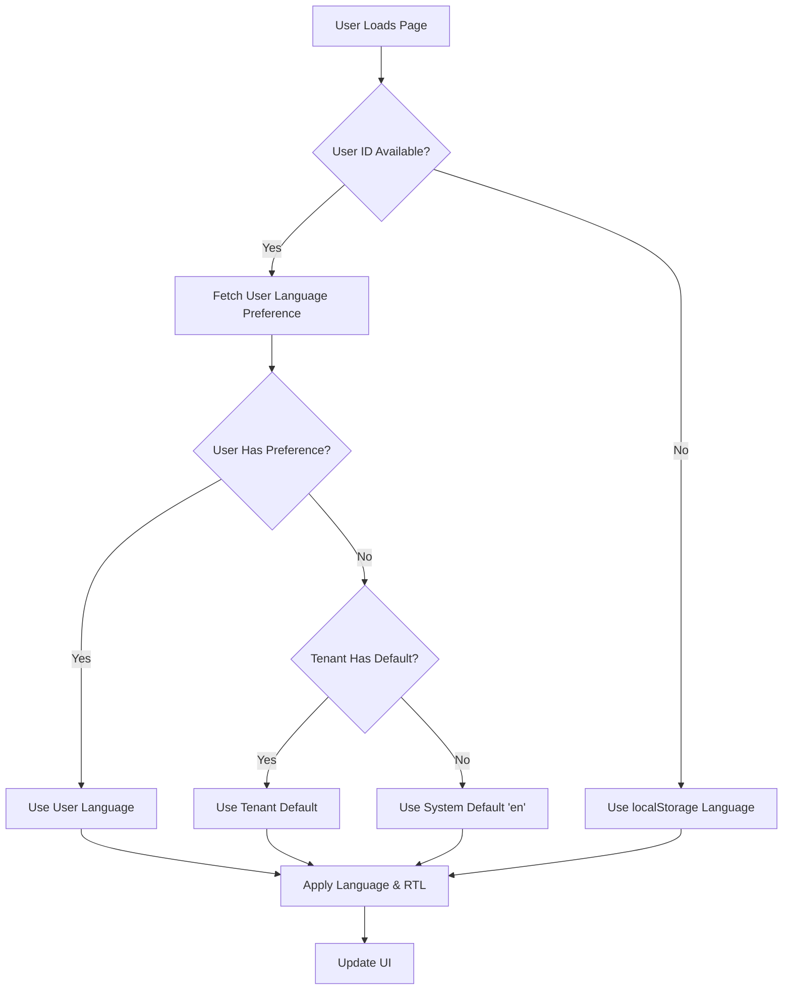

# Multi-User Multilingual Implementation

## Overview

This implementation provides comprehensive tenant-based multilingual support with **individual user language preferences** for our Next.js multi-tenant admin panel using react-i18next.

## 🌍 Supported Languages

- **English (en)** - Default
- **Hindi (hi)** - हिंदी
- **Urdu (ur)** - اُردُو (RTL)
- **Arabic (ar)** - العربية (RTL)
- **Bengali (bn)** - বাংলা
- **French (fr)** - Français

## 📁 File Structure

```
src/
├── hooks/
│   ├── useUserLanguage.ts          # Individual user language management
│   └── useTenantLanguage.ts        # Backwards-compatible wrapper
├── components/
│   ├── common/
│   │   └── LanguageSwitcher.tsx    # Universal language switcher
│   ├── tenant/
│   │   └── UserLanguageSettings.tsx # User-specific language settings
│   └── superadmin/
│       └── SuperAdminLanguageSettings.tsx # Super admin language settings
├── app/
│   ├── api/user/language/route.ts  # User language API endpoint
│   ├── i18n-provider.tsx           # i18n configuration
│   └── [tenantSlug]/
│       ├── settings/page.tsx       # Updated settings with language switcher
│       └── language-demo/page.tsx  # Demo page for testing
└── public/locales/
    ├── en/{common,users,settings}.json
    ├── hi/{common,users,settings}.json
    ├── ur/{common,users,settings}.json
    ├── ar/{common,users,settings}.json
    ├── bn/{common,users,settings}.json
    └── fr/{common,users,settings}.json
```

## 🎯 Key Features

### 1. **Individual User Language Preferences**
- Each user (including super admins) can set their own language
- Language preference stored in user/superadmin database records
- Personal preference overrides tenant defaults

### 2. **Language Priority System**
```
1. User's Personal Preference (highest priority)
2. Tenant Default Language (fallback)
3. System Default ("en") (final fallback)
```

### 3. **RTL Support**
- Automatic right-to-left layout for Arabic and Urdu
- Dynamic `document.documentElement.dir` switching
- CSS and Tailwind compatibility

### 4. **Multi-User Type Support**
- **Regular Users**: Language preference with tenant fallback
- **Super Admins**: Global language preference independent of tenants
- **Guests**: Use system/tenant defaults

## 💾 Database Schema

### User Model Addition
```prisma
model User {
  // ... existing fields
  defaultLanguage   String?            @default("en")
}
```

### SuperAdmin Model Addition
```prisma
model SuperAdmin {
  // ... existing fields
  defaultLanguage   String?            @default("en")
}
```

## 🔌 API Endpoints

### GET `/api/user/language`
Get user's language preference
```typescript
Query Parameters:
- userId: string
- userType: 'user' | 'superadmin'

Response:
{
  userId: string,
  userLanguage: string | null,
  tenantLanguage: string | null,
  effectiveLanguage: string,
  userType: 'user' | 'superadmin'
}
```

### PATCH `/api/user/language`
Update user's language preference
```typescript
Body:
{
  userId: string,
  language: string,
  userType: 'user' | 'superadmin'
}
```

## 🎨 Component Usage

### Basic Language Switcher
```tsx
import { LanguageSwitcher } from '@/components/common/LanguageSwitcher';

// Auto-detect current user
<LanguageSwitcher variant="dropdown" />

// Specific user
<LanguageSwitcher 
  variant="list" 
  userId="user-123" 
  userType="user" 
/>
```

### User Language Settings
```tsx
import { UserLanguageSettings } from '@/components/tenant/UserLanguageSettings';

<UserLanguageSettings userId="user-123" />
```

### Super Admin Language Settings
```tsx
import { SuperAdminLanguageSettings } from '@/components/superadmin/SuperAdminLanguageSettings';

<SuperAdminLanguageSettings superAdminId="admin-456" />
```

## 🔧 Hook Usage

### Individual User Language Hook
```tsx
import { useUserLanguage } from '@/hooks/useUserLanguage';

const {
  currentLanguage,
  isLoading,
  error,
  changeLanguage,
  refreshSettings,
  userLanguageData
} = useUserLanguage(userId, userType);
```

### Backwards Compatible Hook
```tsx
import { useTenantLanguage } from '@/hooks/useTenantLanguage';

// Automatically detects current user from localStorage
const { currentLanguage, changeLanguage } = useTenantLanguage();
```

## 🌐 Translation Files

### Structure
```json
// public/locales/en/common.json
{
  "dashboard": "Dashboard",
  "users": "Users",
  "settings": "Settings",
  "language": "Language"
}

// public/locales/hi/common.json
{
  "dashboard": "डैशबोर्ड",
  "users": "उपयोगकर्ता",
  "settings": "सेटिंग्स",
  "language": "भाषा"
}
```

### Usage in Components
```tsx
import { useTranslation } from 'react-i18next';

const { t } = useTranslation(['common', 'users']);

return (
  <h1>{t('common.dashboard')}</h1>
);
```

## 🧪 Testing

### Run Language Tests
```bash
npx tsx scripts/test-user-languages.ts
```

### Demo Page
Visit `/[tenantSlug]/language-demo` to test:
- User language preferences
- Super admin language preferences
- Language switching functionality
- RTL support

## 🚀 Implementation Examples

### Example 1: Multi-Tenant Gym System
```
Gym A (Hindi-speaking region):
- Tenant default: Hindi (hi)
- User 1: Personal preference: English (en) → Uses English
- User 2: No preference → Uses Hindi (tenant default)
- Super Admin: Personal preference: French (fr) → Uses French globally

Gym B (Arabic-speaking region):
- Tenant default: Arabic (ar)
- User 1: Personal preference: English (en) → Uses English
- User 2: No preference → Uses Arabic (tenant default) + RTL
- Super Admin: Same French preference → Uses French globally
```

### Example 2: Multi-Language Support Team
```
Support Team Tenant:
- Tenant default: English (en)
- Agent 1 (Indian): Hindi (hi) → Uses Hindi
- Agent 2 (Pakistani): Urdu (ur) → Uses Urdu + RTL
- Agent 3 (Arab): Arabic (ar) → Uses Arabic + RTL
- Manager: No preference → Uses English (tenant default)
```

## 🔄 Language Priority Flow



## 📝 Setup Checklist

- [x] ✅ Install next-i18next dependencies
- [x] ✅ Create translation files for all 6 languages
- [x] ✅ Add defaultLanguage fields to User and SuperAdmin models
- [x] ✅ Implement user language API endpoints
- [x] ✅ Create useUserLanguage hook
- [x] ✅ Update LanguageSwitcher for multi-user support
- [x] ✅ Add RTL support for Arabic and Urdu
- [x] ✅ Create user and super admin language components
- [x] ✅ Test database integration
- [x] ✅ Create demo page for testing

## 🔧 Maintenance

### Adding New Languages
1. Add language code to supported languages in API
2. Create translation files in `public/locales/[lang]/`
3. Update language options in `LanguageSwitcher.tsx`
4. Add RTL support if needed

### Translation Management
- Translations are stored in JSON files
- Use the generation script for bulk updates
- Maintain consistency across all namespaces

## 🐛 Troubleshooting

### Common Issues
1. **Language not persisting**: Check localStorage and database sync
2. **RTL not working**: Verify `document.documentElement.dir` setting
3. **Translations missing**: Check translation file structure
4. **API errors**: Verify user ID and type parameters

### Debug Information
- Check browser localStorage for `language`, `userId`, `userType`
- Use React DevTools to inspect hook states
- Monitor API calls in Network tab
- Check Prisma Studio for database values

## 🔮 Future Enhancements

1. **Automatic Language Detection**: Browser/IP-based detection
2. **Translation Management UI**: Admin interface for translations
3. **Pluralization Support**: Advanced i18n features
4. **Date/Time Localization**: Regional formatting
5. **Currency Localization**: Multi-currency support
6. **Lazy Loading**: Dynamic translation loading
